Date 28.3.2026  
Thomas Punnala  
# Data processing pipeline in AWS

## Introduction
This project implements a simple serverless file processing architecture in Amazon Web Services using Infrastructure as Code with Terraform. The goal is to deploy small cloud-based solution that can automatically process files uploaded to cloud storage.  
In this architecture files uploaded to an Amazon S3 bucket trigger and AWS lambda function. The lambda function processes the file (counts words and lines inside of the text file and adds timestamp) and stores the result in seperate S3 output bucket.
The main objective is to gain experience in simple event driven cloud architecture, deploying infrastructure using Terraform and using AWS managed services S3 and Lambda.  
For the phace 2 implementation I added a lifecycle policy for the S3 output bucket.  

## Resources
S3  
Lambda   
Glacier

## Design
This architecture is based on an event driven serverless model. When file is uploaded to an S3 input bucket, and event triggers a Lambda function that processes the file and stores the result in an S3 output bucket.
Serverless approach was chosen to reduce operational complexity. AWS lambda eliminates the need to manage servers and allows automatic scaling based on events.  
There is also no VPC usage. All selected services are fully managed AWS services that operate outside of user defined VPC by default. Adding a VPC would add unnecessary complexity without providing additional benefits in this project.  
Terraform is used to define and deploy the infrastructure as code. This allows the enviroment to be recreated quickly.  
Seperate S3 buckets are used to keep architecture clear and also makes it easier to manage permissions and lifecycle policies in future.  
Because the system is event driven it triggers only when new data is uploaded. This reduces cost and improves efficiency.  
Lifecycle policy was added for the S3 output bucket to tranfer processed files in to Glacier storage after 30 days and deletation of those files after 120 days.  

## Implementation
### Setting up AWS and Terraform
I started this project by launching my Linux Debian virtualmachine. I created local directory to store AWS credentials by using command `mkdir ~/.aws`, this is the standard path where the AWS CLI and Terraform will look for the credentials.  

Next, I created file for the credentials by using command `nano ~/.aws/credentials` and added my access key, secret access key and session token locally.  

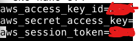  

Next, I installed AWS CLI in my local Linux machine by using command `sudo apt install awscli`. First time I tried command `aws --version` I got error that my credentials file was not working correctly. I made small change in credentials file (added [default] as first line in file) and got it working.  

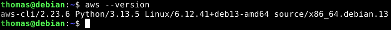  

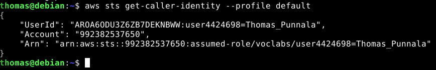  
Credentials working correctly.  

Next, I installed Terraform. Install guide can be found here: https://developer.hashicorp.com/terraform/tutorials/aws-get-started/install-cli  

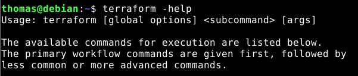  

### Starting Terraform project
I started Terraform project by creating new repository in Github and cloning it to the local mahcine. After this I opened file named provider.tf in VSCode. After providing region and profile to the file I saved it and used command `terraform init` to see if Terraform works with AWS.  

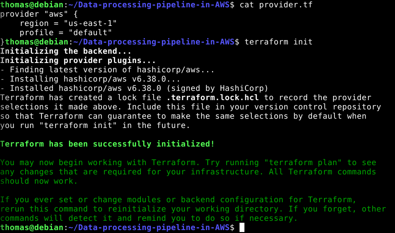  

Next, I added this line in the provider.tf -file: `data "aws_caller_identity" "current" {}`. This tells Terraform who the AWS user is.  

Now I am ready to test creating S3 bucket with Terraform. I created file named main.tf and opened it in VSCode.  

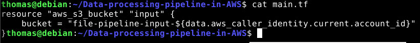  

`terraform plan` gives no errors so I created also the output bucket using same logic. Next, I tried the `terraform apply` and checked if the S3 buckets are created.  

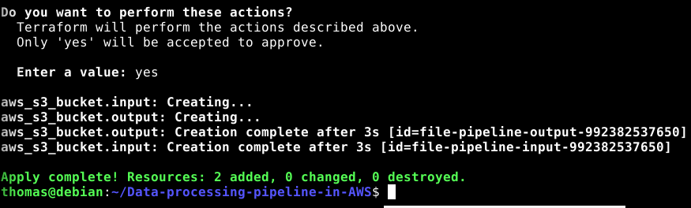  

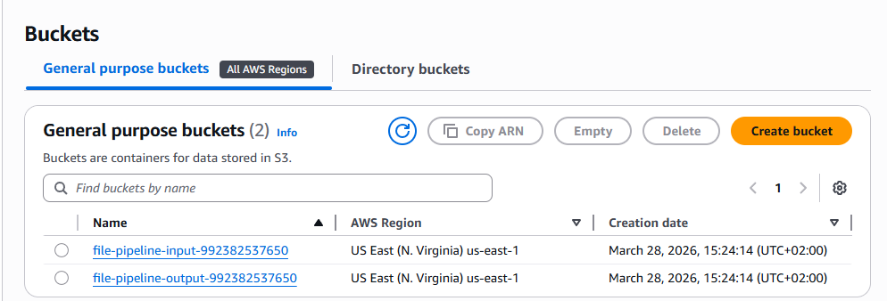  
S3 buckets are created.  

After confirming that the buckets are created, it was time to make directory for the lambda function. I used ChatGPT to create python code for the data processing.  

```
import json
import os
from datetime import datetime
import boto3

s3 = boto3.client("s3")

OUTPUT_BUCKET = os.environ["OUTPUT_BUCKET"]

def lambda_handler(event, context):
    record = event["Records"][0]
    input_bucket = record["s3"]["bucket"]["name"]
    input_key = record["s3"]["object"]["key"]

    response = s3.get_object(Bucket=input_bucket, Key=input_key)
    content = response["Body"].read().decode("utf-8")

    line_count = len(content.splitlines())
    word_count = len(content.split())

    result = {
        "source_bucket": input_bucket,
        "source_key": input_key,
        "line_count": line_count,
        "word_count": word_count,
        "processed_at": datetime.now().isoformat()
    }

    output_key = f"processed/{input_key}.json"

    s3.put_object(
        Bucket=OUTPUT_BUCKET,
        Key=output_key,
        Body=json.dumps(result, indent=2),
        ContentType="application/json"
    )

    return {
        "statusCode": 200,
        "body": json.dumps(result)
    }
```
Basically function processes files uploaded to S3 input bucket and stores result as JSON file in output S3 bucket. Function uses AWS SDK for Python (boto3) to interact with S3.  

Next, I packed code in to ZIP file before deployment. This is done because AWS Lambda is expecting ZIP-file instead of the .py-file.  

### Creating IAM role
Added to main.tf code for the IAM-role.  

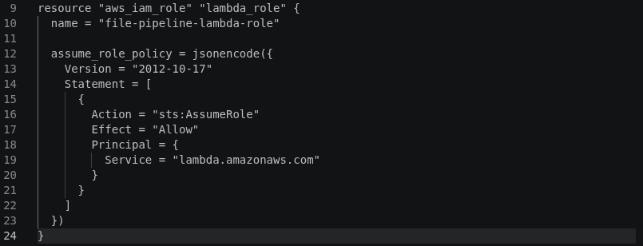  

  
Testing `terraform plan`  

### Adding rules to the IAM role
Now that I created the IAM role for the lambda function, it is time to add permissions to the role. This policy will allow Lambda to write CloudWatch Logs, with this I will be able to see easily what Lambda is doing.  
In second part Lambda has right to take file from the S3 input bucket and process it. In third part Lambda is given right to write the new file in the output bucket.  

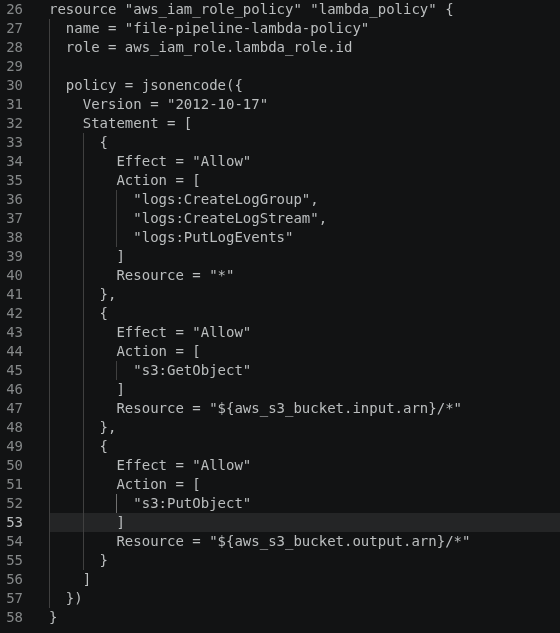  

### Creating Lambda resource
This lambda resource is named as processor and function name is file-pipeline-processor. Recently created IAM role is attached to it. Also there is our python-function as zip-file which the Lambda function will be using. Source hash is also added for Terraform to notice if code is changed. Also enviroment variable is set to write in S3 output bucket.  
I added also automatic zipping for python code. This is done because if someone else tries to use this project they do not need manually zip python file before using.  

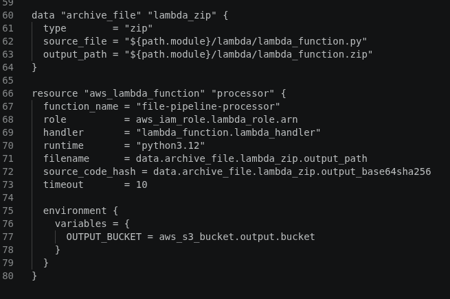  

After trying `terraform apply` I got error this error:  
aws_iam_role.lambda_role: Creating...
╷
│ Error: creating IAM Role (file-pipeline-lambda-role): operation error IAM: CreateRole, https response error StatusCode: 403, RequestID: b8e3d809-d190-4f1f-8933-aeea88191204, api error AccessDenied: User: arn:aws:sts::992382537650:assumed-role/voclabs/user4424698=Thomas_Punnala is not authorized to perform: iam:CreateRole on resource: arn:aws:iam::992382537650:role/file-pipeline-lambda-role because no identity-based policy allows the iam:CreateRole action
│ 
│   with aws_iam_role.lambda_role,
│   on main.tf line 9, in resource "aws_iam_role" "lambda_role":
│    9: resource "aws_iam_role" "lambda_role" {  

Instead of creating my own IAM role, I tried to using precreated IAM role and see if it works with that. main.tf at this point:  
```
resource "aws_s3_bucket" "input" {
  bucket = "file-pipeline-input-${data.aws_caller_identity.current.account_id}"
}

resource "aws_s3_bucket" "output" {
  bucket = "file-pipeline-output-${data.aws_caller_identity.current.account_id}"
}

data "aws_iam_role" "labrole" {
  name = "LabRole"
}

data "archive_file" "lambda_zip" {
  type        = "zip"
  source_file = "${path.module}/lambda/lambda_function.py"
  output_path = "${path.module}/lambda/lambda_function.zip"
}

resource "aws_lambda_function" "processor" {
  function_name    = "file-pipeline-processor"
  role             = data.aws_iam_role.labrole.arn
  handler          = "lambda_function.lambda_handler"
  runtime          = "python3.12"
  filename         = data.archive_file.lambda_zip.output_path
  source_code_hash = data.archive_file.lambda_zip.output_base64sha256
  timeout          = 10

  environment {
    variables = {
      OUTPUT_BUCKET = aws_s3_bucket.output.bucket
    }
  }
}
```
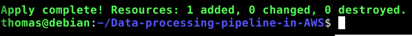  

### Lets run some tests

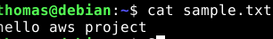  
Make example text-file  

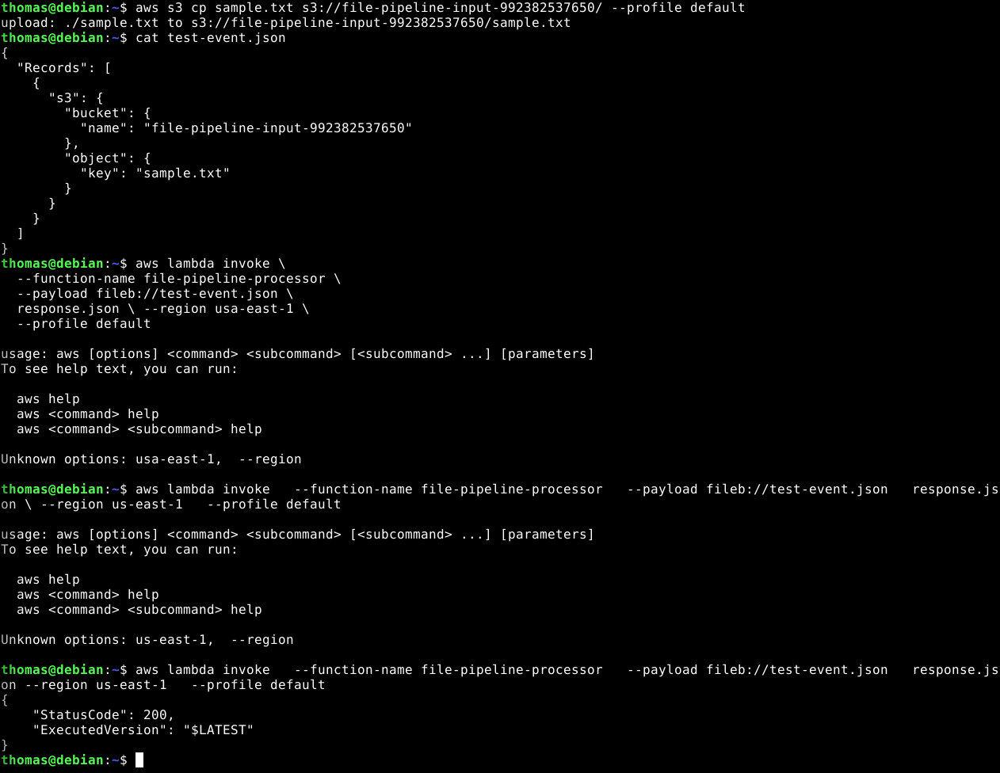  
Copy example test to the input bucket and make test event for Lambda. Run test event manually.  

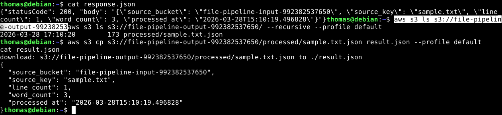  
Check the response.json and see if response was written in output bucket. Copy file from output bucket and see result. Seems to be working.  

### Add S3 triggers for Lambda function
In this part S3 is given permission to use Lambda function when input bucket is receiving new txt-file. Depends on was included so Terraform will wait for permission before creating bucket notification. 

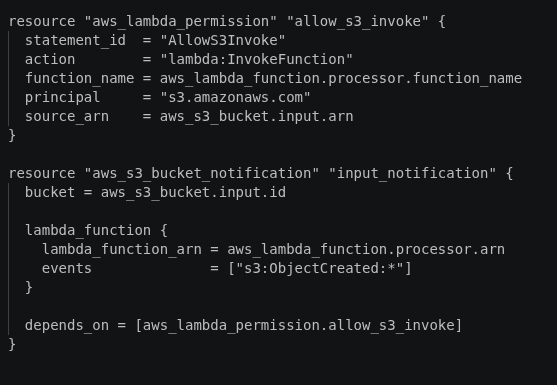  

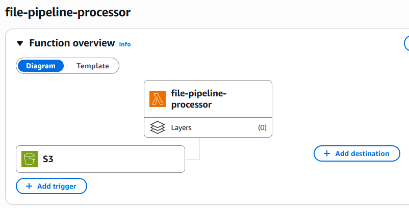  

### Testing

```
echo -e "aws project test\nthis is the second line" > final-test.txt
aws s3 cp final-test.txt s3://file-pipeline-input-992382537650/ --profile default
```  

```
aws s3 ls s3://file-pipeline-output-992382537650/processed/ --profile default
```
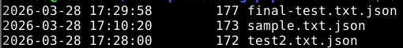  

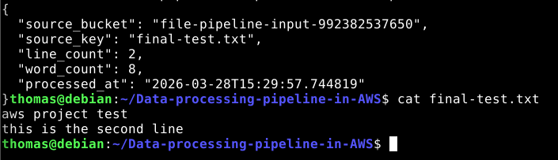  

### Phase 2 implementation
For the lifecycle policy I added this code in to main.tf -file.  
```
resource "aws_s3_bucket_lifecycle_configuration" "output_lifecycle" {
  bucket = aws_s3_bucket.output.id

  rule {
    id     = "archive-and-expire-processed-files"
    status = "Enabled"

    filter {
      prefix = "processed/"
    }

    transition {
      days          = 30
      storage_class = "GLACIER"
    }

    expiration {
      days = 120
    }
  }
}
```
This rule will add lifecycle policy for the S3 bucket. Rule will be added to the output bucket. There is also added filter for prefix, basically objects that include prefix "processed/" will be affected by this rule. Files will be tranfered to the Glacier storage after 30 days and complete deletion will be after 120 days.  
Note: Lifecycle will be affected only to objects larger than 128KB. AWS does not transition smaller objects to Glacier storage classes by default.  

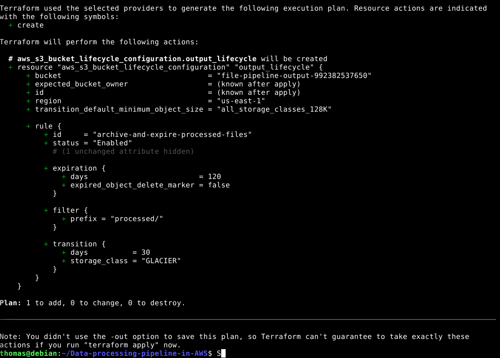  
After adding the policy I run terraform plan and it looks to be working. Next, I will apply it and see how it works.  

Apply was completed and on resource added. Now it´s time to test it.  

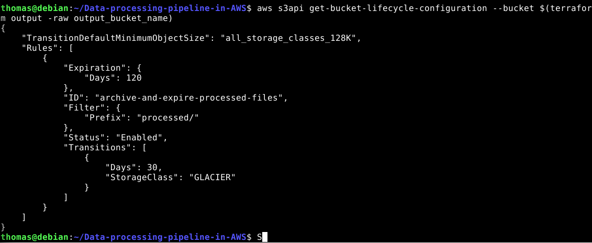  
As we can see the lifecycle policy is attached to the output bucket.  

Lifecycle policy is now applied. However AWS enforces a minimum object size of 128 KB for lifecycle transitions which means small output files may not be transitioned to Glacier in this demo.  

## Enhancements
This project can be enchanced with adding Amazon Simple Notification Service to trigger after Lambda function.  

### References

Terraform. 2026. https://registry.terraform.io/providers/hashicorp/aws/6.38.0  

AWS_CLI_DOCUMENTATION. 2026. https://docs.aws.amazon.com/cli/latest/userguide/cli_code_examples.html  
